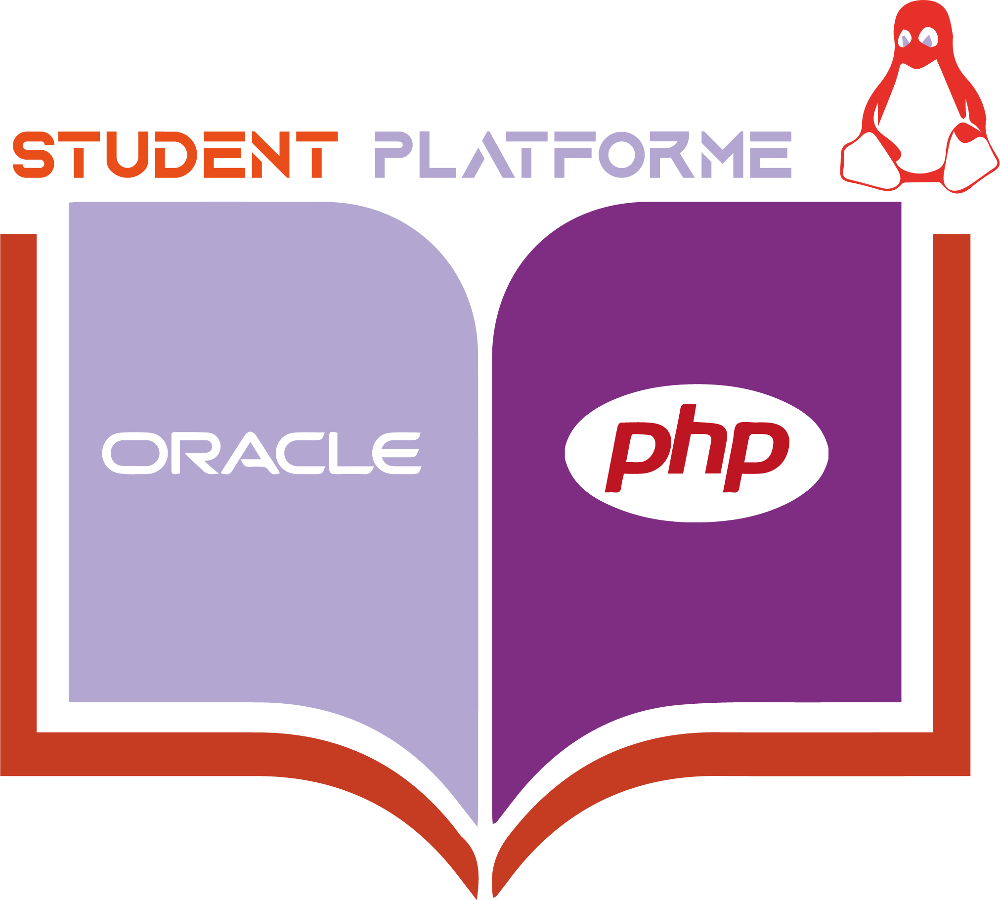

> Student Platform Application Project 
-----

## Table de project 

voici les partie majeurs de l'application :

- [Description](#description)
- [Utilisation]()
- [Navigation]()
---
## Description

* Ce project est une application web , consite a faire une gestion des etudiants 
au sein d'un etablisement , l'objective est organiser l'affectation des chefs de filiere 
au filieres , les etudiant au filiere et modules , et aussi chef de filiere et 
prof au filiere et au deppartement .

### Technologies :

* Laravel 9 : coté back-end
* html / css / bootstrap : coté presetation
* java-script : coté front-end
* Oracle 11g : SGBD

